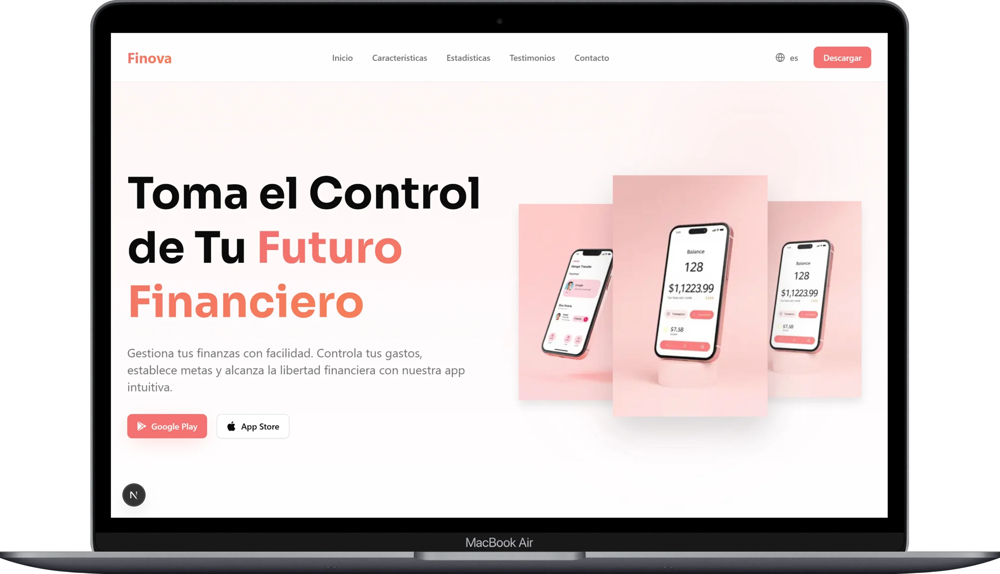

# Finova Landing Page

[](https://nextjs.org/)
[](https://tailwindcss.com/)
[](https://www.framer.com/motion/)

**Finova** es una landing page moderna y dinámica para una aplicación de banca digital y gestión financiera. Este proyecto destaca por su diseño premium, animaciones fluidas.

## 📸 Vista Previa

<div align="center">
  
</div>

<br />

<div align="center">
  
</div>

## ✨ Características Principales

- 🚀 **Diseño Premium:** Estética moderna con modo oscuro, gradientes elegantes y tipografía Sora.
- 🎬 **Animaciones:** Experiencia de usuario inmersiva utilizando **Framer Motion** para transiciones y micro-interacciones.
- 📱 **Totalmente Responsivo:** Optimizado para dispositivos móviles, tablets y escritorio.
- ⚡ **Alto Rendimiento:** Construido sobre Next.js 15+ para una velocidad de carga y SEO óptimos.

## 🛠️ Tecnologías Utilizadas

- **Framework:** [Next.js](https://nextjs.org/)
- **Estilos:** [Tailwind CSS](https://tailwindcss.com/)
- **Animaciones:** [Framer Motion](https://www.framer.com/motion/)
- **Iconos:** [Lucide React](https://lucide.dev/) y [Simple Icons](https://simpleicons.org/)
- **Fuentes:** Google Fonts (Sora, Geist)
- **Componentes:** Radix UI / Shadcn UI

## 🌐 Créditos de Recursos

Para los iconos de plataformas sociales y tiendas de aplicaciones, se han utilizado recursos de:

- [Simple Icons](https://simpleicons.org/): Iconos SVG de alta calidad para Google Play y Apple.

## 🚀 Instalación y Uso

1.  **Clonar el repositorio:**

    ```bash
    git clone https://github.com/roberto-aq/finova-landing-page.git
    cd finova-landing-page
    ```

2.  **Instalar dependencias:**

    ```bash
    npm install
    ```

3.  **Iniciar el servidor de desarrollo:**

    ```bash
    npm run dev
    ```

4.  **Construir para producción:**
    ```bash
    npm run build
    npm start
    ```

## 📁 Estructura del Proyecto

- `/app`: Rutas y layouts principales.
- `/components`: Componentes modulares de la interfaz (Hero, Features, Stats, etc.).
- `/assets`: Recursos visuales y mockups.
- `/data`: Datos estáticos y configuración de navegación.

## 📐 Landing Page Completa en Móvil

<div align="center">
  
</div>

---

Desarrollado con ❤️ para demostrar capacidades de diseño y desarrollo web moderno.
